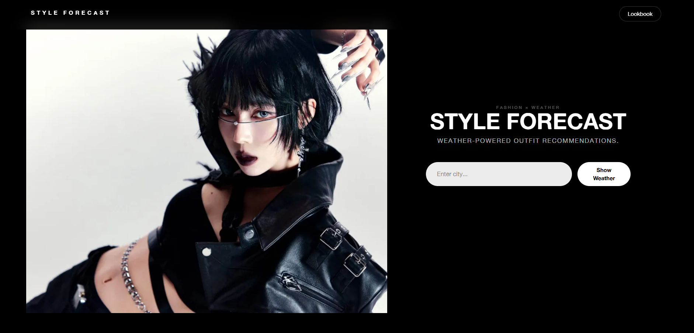

# Style Forecast



### Style Forecast is a Blazor web application that delivers weather-aware fashion recommendations, helping users discover outfits tailored to current conditions in their chosen location. By combining real-time weather data with fashion products from ASOS, the platform creates a personalised shopping and outfit inspiration experience.

---

## About

Choosing what to wear shouldn't require checking five different apps.

Style Forecast analyses live weather conditions and curates clothing recommendations that suit the temperature, season, and forecast. Users can explore products, discover new styles, and save their favourite pieces to a personal Lookbook for future inspiration.

---

## Features

### Live Weather Integration
- Retrieve current weather conditions using the OpenWeather API
- Search by location
- Weather-driven outfit recommendations

### Smart Fashion Discovery
- Browse clothing recommendations sourced from ASOS
- View products tailored to current weather conditions
- Seasonal and category-based recommendations

### Search & Filtering
- Filter products by category
- Search by keyword
- Browse products more efficiently

### Personal Lookbook
- Save favourite fashion items
- Build a curated collection of outfit inspiration
- Access saved products anytime

---

## Built With

- **Blazor Server**
- **C#**
- **ASP.NET Core**
- **HTML5**
- **CSS3**
- **OpenWeather API**
- **ASOS API (RapidAPI)**

---

## APIs

### Weather Data
OpenWeather API

https://openweathermap.org/api

### Fashion Products
ASOS API via RapidAPI

https://rapidapi.com/apidojo/api/Asos

---

## Application Highlights

- Responsive interface
- Weather-aware recommendations
- Fashion-focused user experience
- Personal Lookbook functionality
- Modern UI inspired by contemporary fashion platforms

---

## Installation

### Clone the Repository

```bash
git clone https://github.com/meghank1066/StyleAssistantCA1_SOA_MeghanKeightley.git
```

### Navigate to the Project

```bash
cd StyleAssistantCA1_SOA_MeghanKeightley
```

### Restore Dependencies

```bash
dotnet restore
```

### Run the Application

```bash
dotnet run
```

The application will launch locally and be available through your browser.

---

## Author

**Meghan Keightley**

Created as part of a Service-Oriented Architecture project, exploring the integration of external APIs, responsive design, and personalised user experiences.

---

## Future Improvements

- User authentication
- Expanded retailer integrations
- AI-powered outfit suggestions
- Enhanced recommendation engine
- Seasonal trend forecasting
